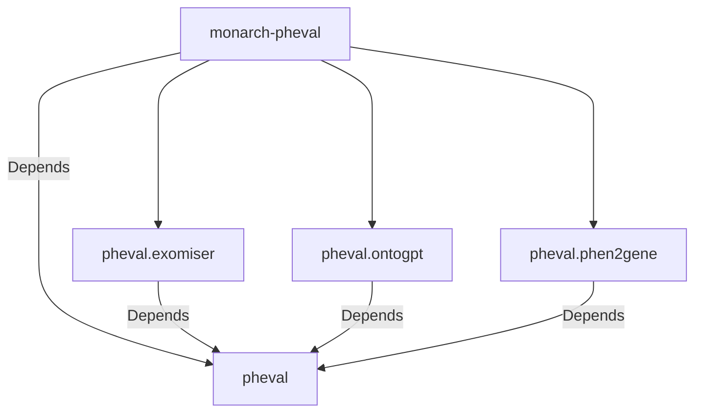

# monarch-pheval

[PhEval](https://github.com/monarch-initiative/pheval) Project Configuration-Base

- [monarch-pheval](#monarch-pheval)
  - [Dependency Graph](#dependency-graph)
  - [PhEval Config Structure](#pheval-config-structure)
  - [Configuring and Running an Experiment](#configuring-and-running-an-experiment)
    - [Installing dependencies](#installing-dependencies)
    - [Editing PhEval configuration file](#editing-pheval-configuration-file)
    - [Adding Exomiser Configuration File](#adding-exomiser-configuration-file)
    - [Preset Exome Analysis File](#preset-exome-analysis-file)
    - [Generating Makefile](#generating-makefile)
    - [Run the experiment](#run-the-experiment)
- [Acknowledgements](#acknowledgements)

## Dependency Graph



---

> - Straight line represents mandatory dependency;

---

With this new feature, the Makefile can be generated within this repo, and the user can invoke the make pheval goal based on the [pheval configuration file](resources/pheval-config.yaml).

## PhEval Config Structure

The corpora and configuration data were moved from [PhEval](https://github.com/monarch-initiative/pheval) to this new structure.

📦monarch-pheval
 ┣ 📂corpora
 ┃ ┣ 📂lirical
 ┃ ┃ ┗ 📂default
 ┃ ┃ ┃ ┣ 📂phenopackets
 ┃ ┃ ┃ ┗ 📜corpus.yml
 ┃ ┣ 📂phen2gene
 ┃ ┃ ┣ 📂default
 ┃ ┃ ┃ ┣ 📂phenopackets
 ┃ ┃ ┃ ┗ 📜corpus.yml
 ┃ ┃ ┗ 📂scrambled-0.5
 ┃ ┃ ┃ ┗ 📂vcf
 ┃ ┣ 📂small_test
 ┃ ┃ ┗ 📂default
 ┃ ┃ ┃ ┣ 📂phenopackets
 ┃ ┃ ┃ ┗ 📜corpus.yml
 ┃ ┗ 📂structural_variants
 ┃ ┃ ┗ 📂default
 ┃ ┃ ┃ ┣ 📂phenopackets
 ┃ ┃ ┃ ┗ 📜corpus.yml
 ┣ 📂resources
 ┃ ┣ 📜Makefile.j2
 ┃ ┣ 📜custom.Makefile
 ┃ ┣ 📜generatemakefile.sh
 ┃ ┗ 📜pheval-config.yaml

## Configuring and Running an Experiment

### Installing dependencies

```bash
poetry shell
poetry install
```

### Editing PhEval configuration file

```yaml
directories:
  tmp: data/tmp
  exomiser: /path_where_exomiser_was_extracted
  phenotype: /path_where_phenotype_was_extracted
  workspace: /pheval's_path # path where pheval was cloned

corpora:
  - id: small_test
    scrambled:
      - factor: 0.5
      - factor: 0.7
    custom_variants:
      - id: no_phenotype

configs:
  - tool: exomiser
    version: 13.2.0
    configuration: default
    exomiser_db: semsim1

runs:
  - tool: exomiser
    configuration: default
    corpus: small_test
    corpusvariant: scrambled-0.5
    version: 13.2.0
```

### Adding Exomiser Configuration File

```yaml
tool: exomiser
tool_version: 13.2.0
variant_analysis: True
gene_analysis: True
disease_analysis: True
tool_specific_configuration_options:
  environment: local
  exomiser_software_directory: .
  analysis_configuration_file: preset-exome-analysis.yml
  max_jobs: 0
  application_properties:
    remm_version:
    cadd_version:
    hg19_data_version: 2302
    hg19_local_frequency_path:
    hg38_data_version: 2302
    phenotype_data_version: 2302
    cache_type:
    cache_caffeine_spec:
  post_process:
    score_name: combinedScore
    sort_order: DESCENDING
```

### Preset Exome Analysis File

Exomiser requires a _preset-exome-analysis.yml_ file saved at **/path_where_exomiser_was_extracted/preset-exome-analysis.yml**

This is an example of preset-exome-analysis.yml file

```yaml
## Exomiser Analysis Template.
# These are all the possible options for running exomiser. Use this as a template for
# your own set-up.
---
analysisMode: PASS_ONLY
inheritanceModes:
  {
    AUTOSOMAL_DOMINANT: 0.1,
    AUTOSOMAL_RECESSIVE_HOM_ALT: 0.1,
    AUTOSOMAL_RECESSIVE_COMP_HET: 2.0,
    X_DOMINANT: 0.1,
    X_RECESSIVE_HOM_ALT: 0.1,
    X_RECESSIVE_COMP_HET: 2.0,
    MITOCHONDRIAL: 0.2,
  }
frequencySources: [
    THOUSAND_GENOMES,
    TOPMED,
    UK10K,

    ESP_AFRICAN_AMERICAN,
    ESP_EUROPEAN_AMERICAN,
    ESP_ALL,

    EXAC_AFRICAN_INC_AFRICAN_AMERICAN,
    EXAC_AMERICAN,
    EXAC_SOUTH_ASIAN,
    EXAC_EAST_ASIAN,
    EXAC_FINNISH,
    EXAC_NON_FINNISH_EUROPEAN,
    EXAC_OTHER,

    GNOMAD_E_AFR,
    GNOMAD_E_AMR,
    #        GNOMAD_E_ASJ,
    GNOMAD_E_EAS,
    GNOMAD_E_FIN,
    GNOMAD_E_NFE,
    GNOMAD_E_OTH,
    GNOMAD_E_SAS,

    GNOMAD_G_AFR,
    GNOMAD_G_AMR,
    #        GNOMAD_G_ASJ,
    GNOMAD_G_EAS,
    GNOMAD_G_FIN,
    GNOMAD_G_NFE,
    GNOMAD_G_OTH,
    GNOMAD_G_SAS,
  ]
# Possible pathogenicitySources: (POLYPHEN, MUTATION_TASTER, SIFT), (REVEL, MVP), CADD, REMM
# REMM is trained on non-coding regulatory regions
# *WARNING* if you enable CADD or REMM ensure that you have downloaded and installed the CADD/REMM tabix files
# and updated their location in the application.properties. Exomiser will not run without this.
pathogenicitySources: [REVEL, MVP]
#this is the standard exomiser order.
steps:
  [
    failedVariantFilter: {},
    variantEffectFilter:
      {
        remove:
          [
            FIVE_PRIME_UTR_EXON_VARIANT,
            FIVE_PRIME_UTR_INTRON_VARIANT,
            THREE_PRIME_UTR_EXON_VARIANT,
            THREE_PRIME_UTR_INTRON_VARIANT,
            NON_CODING_TRANSCRIPT_EXON_VARIANT,
            NON_CODING_TRANSCRIPT_INTRON_VARIANT,
            CODING_TRANSCRIPT_INTRON_VARIANT,
            UPSTREAM_GENE_VARIANT,
            DOWNSTREAM_GENE_VARIANT,
            INTERGENIC_VARIANT,
            REGULATORY_REGION_VARIANT,
          ],
      },
    frequencyFilter: { maxFrequency: 2.0 },
    pathogenicityFilter: { keepNonPathogenic: true },
    inheritanceFilter: {},
    omimPrioritiser: {},
    hiPhivePrioritiser: {},
  ]
```

### Generating Makefile

```bash
./resources/generatemakefile.sh
```

### Run the experiment

```bash
make pheval
```

---

# Acknowledgements

This [cookiecutter](https://cookiecutter.readthedocs.io/en/stable/README.html) project was developed from the [monarch-project-template](https://github.com/monarch-initiative/monarch-project-template) template and will be kept up-to-date using [cruft](https://cruft.github.io/cruft/).
