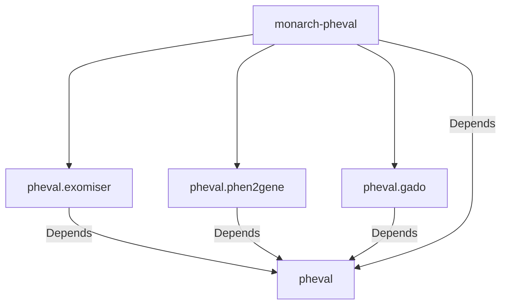
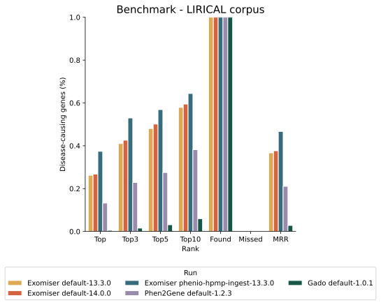

# monarch-pheval

[PhEval](https://github.com/monarch-initiative/pheval) Project Configuration-Base

- [monarch-pheval](#monarch-pheval)
  - [Quick Experiment Description](#quick-experiment-description)
    - [Experiment Data Preparation](#experiment-data-preparation)
    - [Semantic Similarity Calculation](#semantic-similarity-calculation)
  - [SEMSIM SQL File uploaded to Monarch Cloud](#semsim-sql-file-uploaded-to-monarch-cloud)
  - [Dependency Graph](#dependency-graph)
  - [PhEval Config Structure](#pheval-config-structure)
  - [Configuring and Running an Experiment](#configuring-and-running-an-experiment)
    - [Installing dependencies](#installing-dependencies)
    - [Generating Makefile](#generating-makefile)
    - [Run the experiment](#run-the-experiment)
  - [Results](#results)
- [Acknowledgements](#acknowledgements)

## Quick Experiment Description

This experiment was designed with a few PhEval runners, using different VGPAs and versions.
Additionally, we used several Phenotypic data in the Exomiser database: 2309 and 2402, we also made some experiments calculating the Semantic Similarity Profile as a Mapping Table.

**_Important: All files needed for the experiment will be downloaded using the Makefile strategy. Any file links are for inspection purposes and pipeline explanation only. Remember that the `make pheval` goal executes the entire pipeline without needing additional steps._**

- [Exomiser](https://exomiser.readthedocs.io/en/latest/)
  - 13.3.0 (2309 default)
  - 13.3.0 (2309 HPxMP Semsim Ingest)
  - 14.0.0 (2402 default)
- [Phen2Gene](https://phen2gene.wglab.org/)
  - 1.2.3
- [Gado](https://github.com/molgenis/systemsgenetics/wiki/GADO-Command-line)
  - 1.0.1

### Experiment Data Preparation

Exomiser requires a Phenotypical database downloaded from [Monarch Data URL](https://data.monarchinitiative.org/exomiser/data/).
The first two Exomiser experiments were executed using default versions without any changes at all:

- Exomiser 13.3.0 + Phenotype 2309
- Exomiser 14.0.0 + Phenotype 2402

We truncated and ingested a new whole set of values into the **_2309 Phenotypic database_** through a Semantic Similarity Table Ingestion.

### Semantic Similarity Calculation

To calculate a Semantic Similarity profile to be used as an **_Exomiser Phenotypic Mapping Table_**, we used [OAK Library](https://incatools.github.io/ontology-access-kit/index.html)

Command Executed for Semantic Similarity calculation:

External required files for this calculation:

- [phenio-monarch.db - Phenio Ontology](https://data.monarchinitiative.org/monarch-kg/latest/phenio.db.gz)
- hp_terms.txt - generated with oak getting all hp terms
- mp_terms.txt - generated with oak getting all mp terms

```bash
runoak -i semsimian:sqlite:data/ontology/phenio-monarch.db\
similarity -p i\
--set1-file data/tmp/hp_terms.txt \
--set2-file data/tmp/mp_terms.txt \
--min-jaccard-similarity 0.4 \
--information-content-file \
data/tmp/phenio_monarch_hp_ic.tsv \
-O csv \
-o profiles/phenio-monarch-hp-mp.0.4.semsimian.tsv
```

Set file 1 contains all HP terms and set file 2 contains all MP terms.

The original `HP_MP_MAPPINGS` table has 13,492,225 records.
On the other hand, the _SEMSIM_ file that was ingested has _1,522,836_. It is important to mention, that the SEMSIM calculation was done using 0.4 _--min-jaccard-similarity_. `HP_HP_MAPPINGS` and `HP_ZP_MAPPINGS` kept its original data.

Information content file passed in the `--information-content-file` was calculated beforehand also using [OAK Library](https://incatools.github.io/ontology-access-kit/index.html) and this is the command used for it:

PS: We've calculated IC Scores for HP and MP separately, and then we merged them into one file.

External required files for this calculation:

- [gene_phenotype.9606.tsv - Homo sapiens](https://data.monarchinitiative.org/latest/tsv/gene_associations/gene_phenotype.9606.tsv.gz)
- [gene_phenotype.10090.tsv - Mus musculus](https://data.monarchinitiative.org/latest/tsv/gene_associations/gene_phenotype.10090.tsv.gz)
- [phenio-monarch.db - Phenio Ontology](https://data.monarchinitiative.org/monarch-kg/latest/phenio.db.gz)

```bash
runoak -i data/ontology/phenio-monarch.db \
-g data/tmp/gene_phenotype.10090.tsv \
-G hpoa_g2p information-content \
-p i i^MP: \
-o data/tmp/phenio_monarch_mp_ic.tsv
```

## SEMSIM SQL File uploaded to Monarch Cloud

In this experiment, the SEMSIM file used for ingestion (generated using the steps described above) was converted to SQL format and uploaded to Monarch Cloud beforehand. So, unless you want to reproduce SEMSIM steps, it's not required to be executed.

It can be downloaded here:
[phenio-monarch-hp-mp.0.4.semsimian.sql](https://storage.googleapis.com/data-public-monarchinitiative/semantic-similarity/latest/phenio-monarch-hp-mp.0.4.semsimian.sql)

This file is described in [pheval-config file](resources/pheval-config.yaml) in `preprocessing` section

```yaml
- tool: exomiser
  id: exomiser-phenio-hpmp-ingest-13.3.0
  preprocessing:
    - phenio-monarch-hp-mp.0.4.semsimian.sql
```

## Dependency Graph



---

> - Straight line represents mandatory dependency;

---

With this new feature, the Makefile can be generated within this repo, and the user can invoke the `make pheval` goal based on the [pheval configuration file](resources/pheval-config.yaml).

## PhEval Config Structure

The corpora and configuration data were moved from [PhEval](https://github.com/monarch-initiative/pheval) to this new structure.

📦monarch-pheval  
┣ 📂corpora  
┃ ┣ 📂lirical  
┃ ┃ ┗ 📂default  
┃ ┃ ┃ ┣ 📂phenopackets  
┃ ┃ ┃ ┗ 📜corpus.yml  
┣ 📂resources  
┃ ┣ 📜Makefile.j2  
┃ ┣ 📜custom.Makefile  
┃ ┣ 📜generatemakefile.sh  
┃ ┗ 📜pheval-config.yaml

## Configuring and Running an Experiment

### Installing dependencies

```bash
poetry shell
poetry install
```

### Generating Makefile

```bash
./resources/generatemakefile.sh
```

### Run the experiment

```bash
make pheval
```

---

## Results



# Acknowledgements

This [cookiecutter](https://cookiecutter.readthedocs.io/en/stable/README.html) project was developed from the [monarch-project-template](https://github.com/monarch-initiative/monarch-project-template) template and will be kept up-to-date using [cruft](https://cruft.github.io/cruft/).
