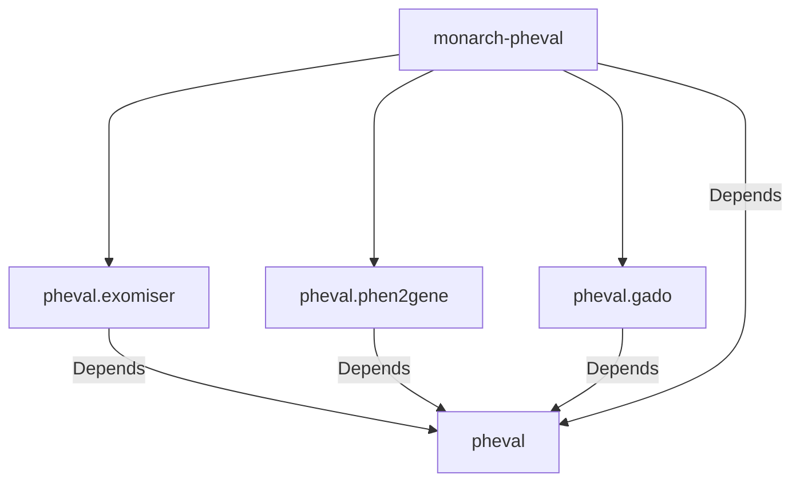

# monarch-pheval

[PhEval](https://github.com/monarch-initiative/pheval) Project Configuration-Base

- [monarch-pheval](#monarch-pheval)
  - [Dependency Graph](#dependency-graph)
  - [PhEval Config Structure](#pheval-config-structure)
  - [Configuring and Running an Experiment](#configuring-and-running-an-experiment)
    - [Installing dependencies](#installing-dependencies)
    - [Generating Makefile](#generating-makefile)
    - [Run the experiment](#run-the-experiment)
- [Acknowledgements](#acknowledgements)

## Dependency Graph



---

> - Straight line represents mandatory dependency;

---

With this new feature, the Makefile can be generated within this repo, and the user can invoke the make pheval goal based on the [pheval configuration file](resources/pheval-config.yaml).

## PhEval Config Structure

The corpora and configuration data were moved from [PhEval](https://github.com/monarch-initiative/pheval) to this new structure.

📦monarch-pheval  
┣ 📂corpora  
┃ ┣ 📂lirical  
┃ ┃ ┗ 📂default  
┃ ┃ ┃ ┣ 📂phenopackets  
┃ ┃ ┃ ┗ 📜corpus.yml  
┣ 📂resources  
┃ ┣ 📜Makefile.j2  
┃ ┣ 📜custom.Makefile  
┃ ┣ 📜generatemakefile.sh  
┃ ┗ 📜pheval-config.yaml

## Configuring and Running an Experiment

### Installing dependencies

```bash
poetry shell
poetry install
```

### Generating Makefile

```bash
./resources/generatemakefile.sh
```

### Run the experiment

```bash
make all
```

---

# Acknowledgements

This [cookiecutter](https://cookiecutter.readthedocs.io/en/stable/README.html) project was developed from the [monarch-project-template](https://github.com/monarch-initiative/monarch-project-template) template and will be kept up-to-date using [cruft](https://cruft.github.io/cruft/).
