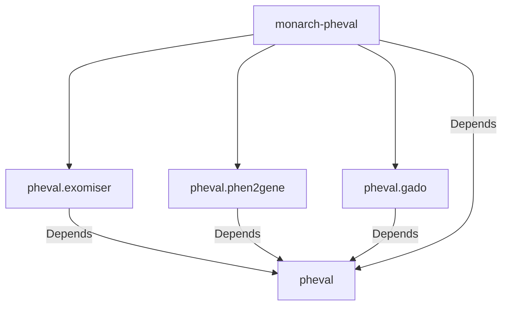

# monarch-pheval

[PhEval](https://github.com/monarch-initiative/pheval) Project Configuration-Base

- [monarch-pheval](#monarch-pheval)
  - [Quick Experiment Description](#quick-experiment-description)
    - [Experiment Data Preparation](#experiment-data-preparation)
    - [Semantic Similarity Calculation](#semantic-similarity-calculation)
  - [Dependency Graph](#dependency-graph)
  - [PhEval Config Structure](#pheval-config-structure)
  - [Configuring and Running an Experiment](#configuring-and-running-an-experiment)
    - [Installing dependencies](#installing-dependencies)
    - [Generating Makefile](#generating-makefile)
    - [Run the experiment](#run-the-experiment)
- [Acknowledgements](#acknowledgements)

## Quick Experiment Description

This experiment was designed with a few PhEval runners, using different VGPAs and versions.
Additionally, we used several Phenotypic data in the Exomiser database: 2309 and 2402, we also made some experiments calculating the Semantic Similarity Profile as a Mapping Table.

- Exomiser
  - 13.3.0 (2309 default)
  - 13.3.0 (2309 HPxMP Semsim Ingest)
  - 14.0.0 (2402 default)
- Phen2Gene
  - 1.2.3
- Gado
  - 1.0.1

### Experiment Data Preparation

Exomiser requires a Phenotypical database downloaded from [Monarch Data URL](https://data.monarchinitiative.org/exomiser/data/).
The first two Exomiser experiments were executed using default versions without any changes at all:

- Exomiser 13.3.0 + Phenotype 2309
- Exomiser 14.0.0 + Phenotype 2402

We truncated and ingested a new whole set of values into the the **_2309 Phenotypic database_** through a Semantic Similarity Table Ingestion.

### Semantic Similarity Calculation

To calculate a Semantic Similarity profile to be used as an **_Exomiser Phenotypic Mapping Table_**, we used [OAK Library](https://incatools.github.io/ontology-access-kit/index.html)

Command Executed for Semantic Similarity calculation:

```bash
runoak -i semsimian:sqlite:data/ontology/phenio-monarch.db similarity -p i --set1-file data/tmp/hp_terms.txt --set2-file data/tmp/mp_terms.txt --min-jaccard-similarity 0.4 --information-content-file data/tmp/phenio_monarch_hp_ic.tsv -O csv -o profiles/phenio-monarch-hp-mp.0.4.semsimian.tsv
```

## Dependency Graph



---

> - Straight line represents mandatory dependency;

---

With this new feature, the Makefile can be generated within this repo, and the user can invoke the `make all` goal based on the [pheval configuration file](resources/pheval-config.yaml).

## PhEval Config Structure

The corpora and configuration data were moved from [PhEval](https://github.com/monarch-initiative/pheval) to this new structure.

📦monarch-pheval  
┣ 📂corpora  
┃ ┣ 📂lirical  
┃ ┃ ┗ 📂default  
┃ ┃ ┃ ┣ 📂phenopackets  
┃ ┃ ┃ ┗ 📜corpus.yml  
┣ 📂resources  
┃ ┣ 📜Makefile.j2  
┃ ┣ 📜custom.Makefile  
┃ ┣ 📜generatemakefile.sh  
┃ ┗ 📜pheval-config.yaml

## Configuring and Running an Experiment

### Installing dependencies

```bash
poetry shell
poetry install
```

### Generating Makefile

```bash
./resources/generatemakefile.sh
```

### Run the experiment

```bash
make all
```

---

# Acknowledgements

This [cookiecutter](https://cookiecutter.readthedocs.io/en/stable/README.html) project was developed from the [monarch-project-template](https://github.com/monarch-initiative/monarch-project-template) template and will be kept up-to-date using [cruft](https://cruft.github.io/cruft/).
